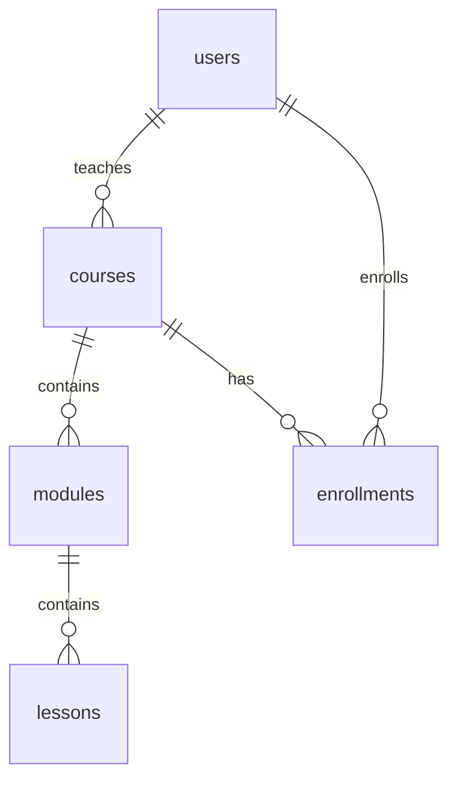

## Rancangan Tabel dan Relasi Tabel

Berikut adalah rancangan tabel untuk database kursus online:

### 1. `users`
Menyimpan informasi pengguna.
- `id` (INT, PRIMARY KEY, AUTO_INCREMENT)
- `username` (VARCHAR(50), UNIQUE, NOT NULL)
- `password` (VARCHAR(255), NOT NULL)
- `email` (VARCHAR(100), UNIQUE, NOT NULL)
- `role` (ENUM('student', 'admin'), DEFAULT 'student')
- `created_at` (TIMESTAMP, DEFAULT CURRENT_TIMESTAMP)

### 2. `courses`
Menyimpan informasi kursus.
- `id` (INT, PRIMARY KEY, AUTO_INCREMENT)
- `title` (VARCHAR(255), NOT NULL)
- `description` (TEXT)
- `instructor_id` (INT, FOREIGN KEY ke `users.id`)
- `price` (DECIMAL(10, 2), DEFAULT 0.00)
- `created_at` (TIMESTAMP, DEFAULT CURRENT_TIMESTAMP)

### 3. `modules`
Menyimpan modul atau bagian dari setiap kursus.
- `id` (INT, PRIMARY KEY, AUTO_INCREMENT)
- `course_id` (INT, FOREIGN KEY ke `courses.id`)
- `title` (VARCHAR(255), NOT NULL)
- `description` (TEXT)
- `order_index` (INT, NOT NULL)

### 4. `lessons`
Menyimpan pelajaran atau materi dalam setiap modul.
- `id` (INT, PRIMARY KEY, AUTO_INCREMENT)
- `module_id` (INT, FOREIGN KEY ke `modules.id`)
- `title` (VARCHAR(255), NOT NULL)
- `content` (LONGTEXT)
- `video_url` (VARCHAR(255))
- `order_index` (INT, NOT NULL)

### 5. `enrollments`
Menyimpan informasi pendaftaran pengguna ke kursus.
- `id` (INT, PRIMARY KEY, AUTO_INCREMENT)
- `user_id` (INT, FOREIGN KEY ke `users.id`)
- `course_id` (INT, FOREIGN KEY ke `courses.id`)
- `enrollment_date` (TIMESTAMP, DEFAULT CURRENT_TIMESTAMP)
- `progress` (DECIMAL(5, 2), DEFAULT 0.00) -- Persentase progress kursus

### Relasi Antar Tabel:

- **`users`** dan **`courses`**: One-to-Many. Satu `users` (sebagai instructor) dapat memiliki banyak `courses` yang diajarkan. (`courses.instructor_id` mereferensi `users.id`)
- **`courses`** dan **`modules`**: One-to-Many. Satu `courses` dapat memiliki banyak `modules`.
- **`modules`** dan **`lessons`**: One-to-Many. Satu `modules` dapat memiliki banyak `lessons`.
- **`users`** dan **`enrollments`**: One-to-Many. Satu `users` dapat mendaftar ke banyak `enrollments`.
- **`courses`** dan **`enrollments`**: One-to-Many. Satu `courses` dapat memiliki banyak `enrollments` dari berbagai pengguna.

### Diagram Relasi (Conceptual):

