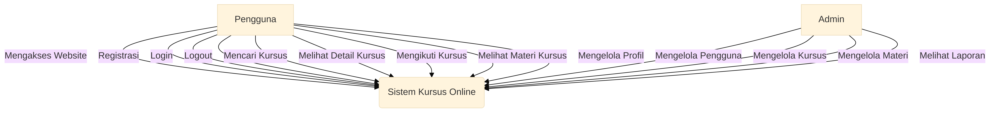
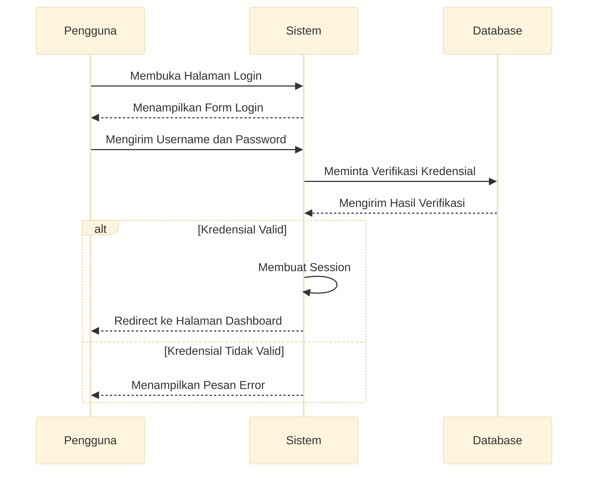
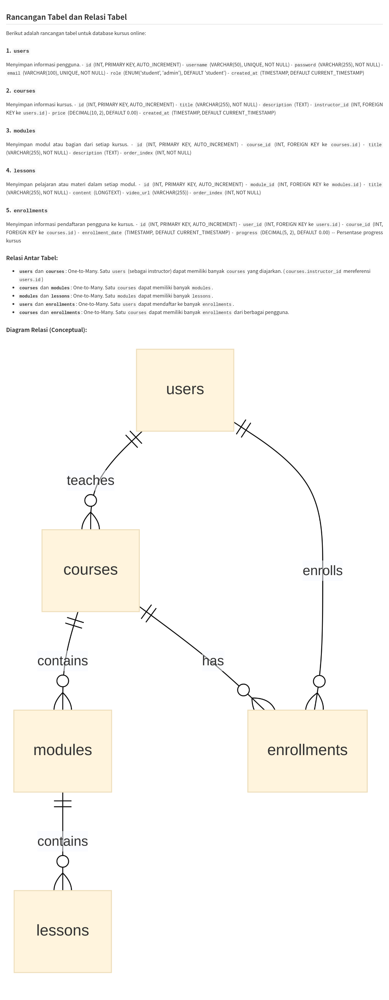
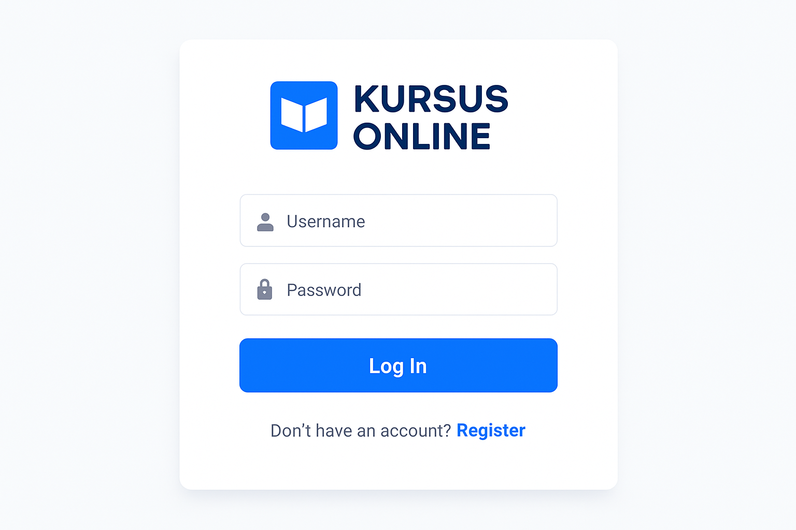
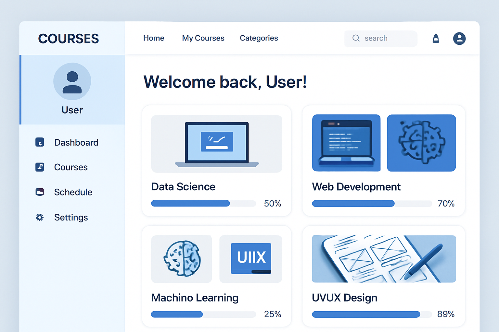
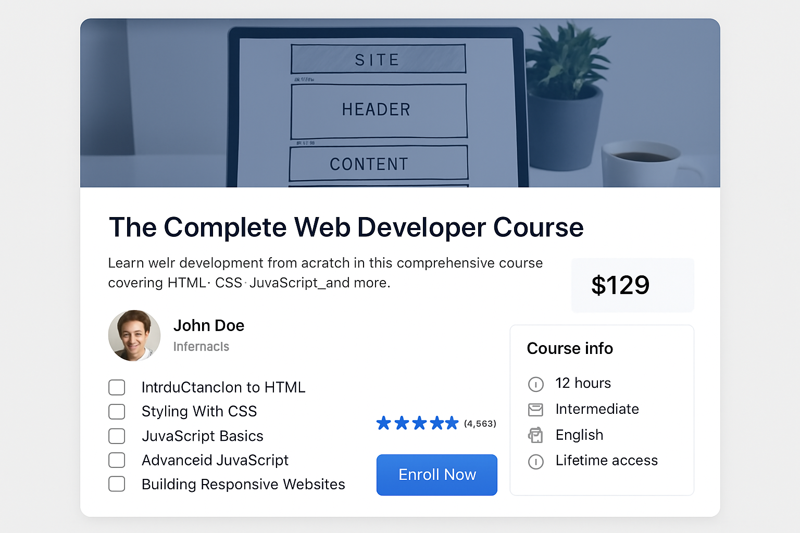
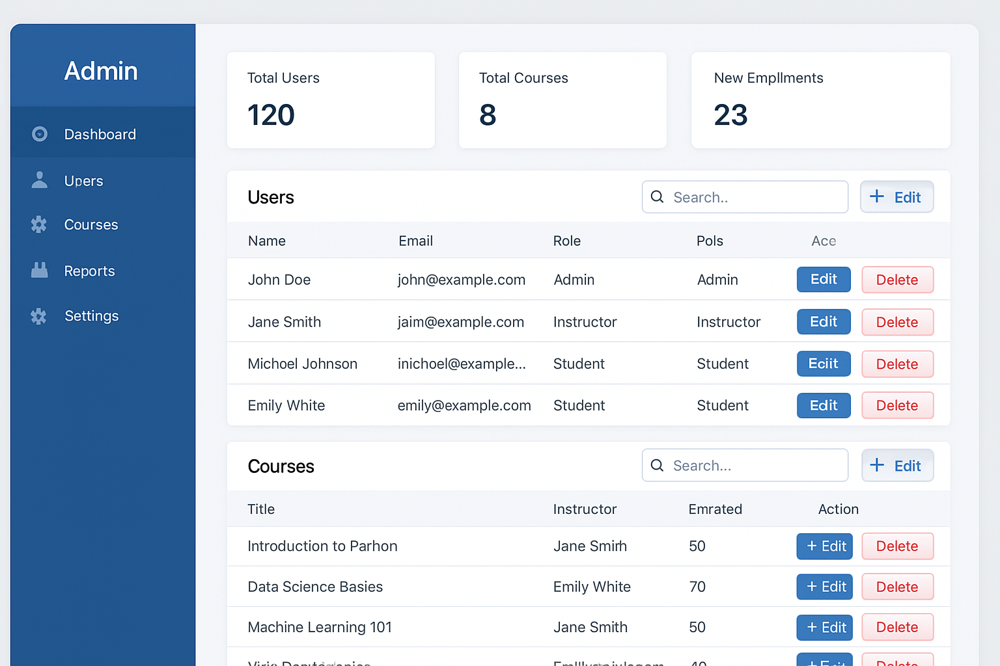

# DOKUMENTASI UAS PEMROGRAMAN WEB
## WEBSITE KURSUS ONLINE

**Mata Kuliah:** Pemrograman Web (PHP)  
**Dosen:** Afri Yudha M.Kom  
**Nama:** [Nama Mahasiswa]  
**NIM:** [NIM Mahasiswa]  

---

## A. ALASAN MEMBUAT RANCANGAN WEB

Alasan membuat rancangan web ini adalah untuk memenuhi tugas Ujian Akhir Semester (UAS) mata kuliah Pemrograman Web (PHP). Rancangan ini bertujuan untuk membangun sebuah platform kursus online yang interaktif dan fungsional, mencakup fitur-fitur penting seperti manajemen pengguna (login/registrasi), pengelolaan materi kursus, dan fungsionalitas pencarian. 

Selain itu, proyek ini juga menjadi sarana untuk mengaplikasikan berbagai konsep pemrograman web yang telah dipelajari, termasuk penggunaan Bootstrap untuk desain responsif, PHP untuk logika backend, dan MySQL untuk manajemen database. Dengan adanya dokumentasi lengkap, diharapkan proyek ini dapat menjadi referensi yang komprehensif bagi pengembangan web di masa mendatang.

Website kursus online ini dipilih karena relevan dengan kebutuhan pendidikan modern yang semakin mengarah ke pembelajaran digital. Platform ini memungkinkan siswa untuk belajar secara fleksibel dan instruktur untuk mengelola materi pembelajaran dengan mudah.

---

## B. FLOWCHART

Flowchart berikut menggambarkan alur kerja sistem kursus online dari perspektif pengguna:


Flowchart di atas menunjukkan proses utama dalam sistem:
1. **Akses Website** - Pengguna mengakses halaman utama
2. **Cek Status Login** - Sistem memeriksa apakah pengguna sudah login
3. **Login/Registrasi** - Jika belum login, pengguna diarahkan ke halaman login
4. **Dashboard** - Setelah login berhasil, pengguna masuk ke dashboard
5. **Pilih Kursus** - Pengguna dapat memilih kursus yang tersedia
6. **Enroll/Belajar** - Pengguna dapat mendaftar atau melanjutkan pembelajaran
7. **Progress Tracking** - Sistem melacak progress pembelajaran pengguna

---

## C. UML DIAGRAMS

### 1. Use Case Diagram



Use Case Diagram menunjukkan interaksi antara aktor (Pengguna dan Admin) dengan sistem:

**Aktor Pengguna:**
- Mengakses Website
- Registrasi dan Login
- Mencari Kursus
- Melihat Detail Kursus
- Mengikuti Kursus
- Melihat Materi Kursus
- Mengelola Profil

**Aktor Admin:**
- Mengelola Pengguna
- Mengelola Kursus
- Mengelola Materi
- Melihat Laporan

### 2. Activity Diagram


Activity Diagram menggambarkan alur aktivitas proses login:
1. Pengguna membuka halaman login
2. Memasukkan username dan password
3. Sistem memvalidasi kredensial
4. Jika valid, sistem membuat session dan redirect ke dashboard
5. Jika tidak valid, menampilkan pesan error

### 3. Sequence Diagram



Sequence Diagram menunjukkan interaksi antar objek dalam proses login:
- **Pengguna** mengirim request login ke **Sistem**
- **Sistem** meminta verifikasi ke **Database**
- **Database** mengembalikan hasil verifikasi
- **Sistem** membuat session jika valid atau menampilkan error jika tidak valid

---

## D. TABEL DAN RELASI TABEL

### Rancangan Database

Database sistem kursus online terdiri dari 5 tabel utama:



### 1. Tabel `users`
Menyimpan informasi pengguna sistem.

| Field | Type | Description |
|-------|------|-------------|
| id | INT (PK, AI) | ID unik pengguna |
| username | VARCHAR(50) | Username pengguna (unique) |
| password | VARCHAR(255) | Password terenkripsi |
| email | VARCHAR(100) | Email pengguna (unique) |
| role | ENUM | Role pengguna (student/admin) |
| created_at | TIMESTAMP | Tanggal registrasi |

### 2. Tabel `courses`
Menyimpan informasi kursus yang tersedia.

| Field | Type | Description |
|-------|------|-------------|
| id | INT (PK, AI) | ID unik kursus |
| title | VARCHAR(255) | Judul kursus |
| description | TEXT | Deskripsi kursus |
| instructor_id | INT (FK) | ID instruktur |
| price | DECIMAL(10,2) | Harga kursus |
| created_at | TIMESTAMP | Tanggal pembuatan |

### 3. Tabel `modules`
Menyimpan modul-modul dalam setiap kursus.

| Field | Type | Description |
|-------|------|-------------|
| id | INT (PK, AI) | ID unik modul |
| course_id | INT (FK) | ID kursus |
| title | VARCHAR(255) | Judul modul |
| description | TEXT | Deskripsi modul |
| order_index | INT | Urutan modul |

### 4. Tabel `lessons`
Menyimpan pelajaran dalam setiap modul.

| Field | Type | Description |
|-------|------|-------------|
| id | INT (PK, AI) | ID unik pelajaran |
| module_id | INT (FK) | ID modul |
| title | VARCHAR(255) | Judul pelajaran |
| content | LONGTEXT | Konten pelajaran |
| video_url | VARCHAR(255) | URL video (opsional) |
| order_index | INT | Urutan pelajaran |

### 5. Tabel `enrollments`
Menyimpan informasi pendaftaran pengguna ke kursus.

| Field | Type | Description |
|-------|------|-------------|
| id | INT (PK, AI) | ID unik enrollment |
| user_id | INT (FK) | ID pengguna |
| course_id | INT (FK) | ID kursus |
| enrollment_date | TIMESTAMP | Tanggal pendaftaran |
| progress | DECIMAL(5,2) | Progress pembelajaran (%) |

### Relasi Antar Tabel

1. **users → courses** (One-to-Many): Satu user dapat mengajar banyak kursus
2. **courses → modules** (One-to-Many): Satu kursus memiliki banyak modul
3. **modules → lessons** (One-to-Many): Satu modul memiliki banyak pelajaran
4. **users → enrollments** (One-to-Many): Satu user dapat mendaftar ke banyak kursus
5. **courses → enrollments** (One-to-Many): Satu kursus dapat memiliki banyak pendaftar

---


## E. MOCKUP (RANCANGAN FIGMA)

Berikut adalah mockup rancangan antarmuka website kursus online yang dibuat dengan gaya desain modern dan profesional:

### 1. Halaman Login



**Deskripsi:**
- Desain minimalis dengan form login di tengah halaman
- Logo "Kursus Online" dengan ikon buku
- Field input untuk username/email dan password
- Tombol login dengan warna biru primer
- Link untuk registrasi dan kembali ke beranda
- Background gradient yang menarik

### 2. Halaman Dashboard



**Deskripsi:**
- Header dengan navigasi menu dan search bar
- Sidebar dengan profil pengguna dan menu navigasi
- Area konten utama menampilkan kursus yang diikuti
- Card kursus dengan thumbnail, judul, dan progress bar
- Desain responsif dengan grid layout
- Warna biru sebagai tema utama

### 3. Halaman Detail Kursus



**Deskripsi:**
- Banner kursus dengan gambar header
- Informasi lengkap kursus (judul, deskripsi, harga)
- Profil instruktur dengan foto dan nama
- Daftar modul kursus dengan checkbox
- Rating dan review kursus
- Tombol "Enroll Now" yang prominent
- Sidebar dengan informasi kursus (durasi, level, bahasa)

### 4. Halaman Admin



**Deskripsi:**
- Sidebar navigasi admin dengan menu lengkap
- Dashboard dengan statistik dalam bentuk cards
- Tabel data pengguna dan kursus
- Fitur search dan filter
- Tombol aksi (Edit, Delete) untuk setiap item
- Desain yang clean dan profesional untuk admin

### Prinsip Desain yang Diterapkan:

1. **Konsistensi Warna**: Menggunakan skema warna biru sebagai warna primer
2. **Typography**: Font yang mudah dibaca dengan hierarki yang jelas
3. **Spacing**: Penggunaan white space yang baik untuk readability
4. **Responsiveness**: Desain yang dapat beradaptasi dengan berbagai ukuran layar
5. **User Experience**: Navigasi yang intuitif dan user-friendly
6. **Visual Hierarchy**: Penggunaan ukuran, warna, dan kontras untuk mengarahkan perhatian

---

## F. IMPLEMENTASI WEBSITE

Website kursus online telah diimplementasikan menggunakan teknologi berikut:

### Teknologi yang Digunakan:
- **Frontend**: HTML5, CSS3, Bootstrap 5, JavaScript
- **Backend**: PHP 7.4+
- **Database**: MySQL
- **Icons**: Font Awesome 6
- **Server**: Apache/Nginx

### Fitur yang Diimplementasikan:

#### 1. **Sistem Autentikasi**
- Registrasi pengguna baru
- Login dengan username/email dan password
- Session management
- Logout functionality
- Password hashing untuk keamanan

#### 2. **Manajemen Pengguna**
- Profil pengguna yang dapat diedit
- Role-based access (student/admin)
- Statistik pembelajaran pengguna

#### 3. **Manajemen Kursus**
- Daftar kursus dengan pagination
- Detail kursus lengkap
- Enrollment ke kursus
- Progress tracking
- Sistem modul dan pelajaran

#### 4. **Fitur Pencarian**
- Real-time search pada halaman kursus
- Filter berdasarkan judul, deskripsi, dan instruktur
- Search pada panel admin

#### 5. **Panel Admin**
- Dashboard admin dengan statistik
- CRUD pengguna
- CRUD kursus
- Manajemen enrollment
- Data analytics

#### 6. **Responsive Design**
- Mobile-friendly interface
- Bootstrap grid system
- Adaptive navigation
- Touch-friendly buttons

### Struktur File:

```
kursus_online/
├── config.php              # Konfigurasi database
├── index.php               # Halaman utama
├── database.sql            # Script database
├── css/
│   └── style.css           # Custom CSS
├── js/
│   └── script.js           # Custom JavaScript
├── includes/
│   ├── header.php          # Template header
│   └── footer.php          # Template footer
├── pages/
│   ├── login.php           # Halaman login
│   ├── register.php        # Halaman registrasi
│   ├── dashboard.php       # Dashboard pengguna
│   ├── courses.php         # Daftar kursus
│   ├── course_detail.php   # Detail kursus
│   ├── course_learn.php    # Halaman pembelajaran
│   ├── profile.php         # Profil pengguna
│   └── logout.php          # Logout
└── admin/
    ├── index.php           # Dashboard admin
    ├── users.php           # Kelola pengguna
    └── courses.php         # Kelola kursus
```

---


## G. SCREENSHOT HALAMAN DAN KODE

### 1. Halaman Utama (index.php)

**Screenshot:**
*[Screenshot akan ditambahkan saat testing]*

**Kode:**
```php
<?php
require_once 'config.php';
$page_title = 'Beranda - Kursus Online';
include 'includes/header.php';

// Ambil data kursus terpopuler
$stmt = $pdo->query("SELECT c.*, u.username as instructor_name, 
                     COUNT(e.id) as total_enrollments 
                     FROM courses c 
                     LEFT JOIN users u ON c.instructor_id = u.id 
                     LEFT JOIN enrollments e ON c.id = e.course_id 
                     GROUP BY c.id 
                     ORDER BY total_enrollments DESC 
                     LIMIT 6");
$popular_courses = $stmt->fetchAll();
?>

<!-- Hero Section dengan Bootstrap -->
<section class="hero-section">
    <div class="container">
        <div class="row align-items-center">
            <div class="col-lg-6">
                <h1 class="display-4 fw-bold mb-4">Belajar Skill Baru dengan Kursus Online</h1>
                <p class="lead mb-4">Platform pembelajaran online terbaik untuk mengembangkan kemampuan Anda.</p>
                <div class="d-flex gap-3">
                    <a href="pages/courses.php" class="btn btn-light btn-lg">Jelajahi Kursus</a>
                    <?php if(!isset($_SESSION['user_id'])): ?>
                    <a href="pages/register.php" class="btn btn-outline-light btn-lg">Daftar Gratis</a>
                    <?php endif; ?>
                </div>
            </div>
        </div>
    </div>
</section>
```

**Penjelasan Kode:**
- Menggunakan `require_once` untuk include konfigurasi database
- Query SQL dengan JOIN untuk mengambil kursus populer berdasarkan jumlah enrollment
- Menggunakan Bootstrap classes untuk responsive design
- Conditional rendering untuk tombol berdasarkan status login

### 2. Halaman Login (pages/login.php)

**Screenshot:**
*[Screenshot akan ditambahkan saat testing]*

**Kode:**
```php
<?php
require_once '../config.php';

// Redirect jika sudah login
if(isset($_SESSION['user_id'])) {
    header('Location: dashboard.php');
    exit();
}

$error = '';

if($_SERVER['REQUEST_METHOD'] == 'POST') {
    $username = trim($_POST['username']);
    $password = $_POST['password'];
    
    if(empty($username) || empty($password)) {
        $error = 'Username dan password harus diisi!';
    } else {
        // Cek user di database
        $stmt = $pdo->prepare("SELECT * FROM users WHERE username = ? OR email = ?");
        $stmt->execute([$username, $username]);
        $user = $stmt->fetch();
        
        if($user && password_verify($password, $user['password'])) {
            // Login berhasil - set session
            $_SESSION['user_id'] = $user['id'];
            $_SESSION['username'] = $user['username'];
            $_SESSION['email'] = $user['email'];
            $_SESSION['role'] = $user['role'];
            
            // Redirect berdasarkan role
            if($user['role'] == 'admin') {
                header('Location: ../admin/index.php');
            } else {
                header('Location: dashboard.php');
            }
            exit();
        } else {
            $error = 'Username/email atau password salah!';
        }
    }
}
?>

<!-- Form Login dengan Bootstrap -->
<div class="login-container">
    <div class="login-card">
        <div class="text-center mb-4">
            <i class="fas fa-graduation-cap fa-3x text-primary mb-3"></i>
            <h2 class="fw-bold">Kursus Online</h2>
        </div>
        
        <?php if($error): ?>
        <div class="alert alert-danger" role="alert">
            <i class="fas fa-exclamation-triangle me-2"></i><?php echo $error; ?>
        </div>
        <?php endif; ?>
        
        <form method="POST" class="needs-validation" novalidate>
            <div class="mb-3">
                <label for="username" class="form-label">Username atau Email</label>
                <div class="input-group">
                    <span class="input-group-text"><i class="fas fa-user"></i></span>
                    <input type="text" class="form-control" id="username" name="username" required>
                </div>
            </div>
            
            <div class="mb-4">
                <label for="password" class="form-label">Password</label>
                <div class="input-group">
                    <span class="input-group-text"><i class="fas fa-lock"></i></span>
                    <input type="password" class="form-control" id="password" name="password" required>
                </div>
            </div>
            
            <div class="d-grid mb-3">
                <button type="submit" class="btn btn-primary btn-lg">
                    <i class="fas fa-sign-in-alt me-2"></i>Masuk
                </button>
            </div>
        </form>
    </div>
</div>
```

**Penjelasan Kode:**
- Validasi input dengan `trim()` dan `empty()`
- Menggunakan prepared statements untuk keamanan SQL injection
- `password_verify()` untuk verifikasi password yang di-hash
- Session management untuk menyimpan data login
- Role-based redirect (admin ke admin panel, user ke dashboard)
- Bootstrap form styling dengan icons

### 3. Halaman Dashboard (pages/dashboard.php)

**Screenshot:**
*[Screenshot akan ditambahkan saat testing]*

**Kode:**
```php
<?php
require_once '../config.php';

// Cek login
if(!isset($_SESSION['user_id'])) {
    header('Location: login.php');
    exit();
}

// Ambil data kursus yang diikuti user
$stmt = $pdo->prepare("SELECT c.*, e.enrollment_date, e.progress 
                       FROM courses c 
                       JOIN enrollments e ON c.id = e.course_id 
                       WHERE e.user_id = ? 
                       ORDER BY e.enrollment_date DESC");
$stmt->execute([$_SESSION['user_id']]);
$enrolled_courses = $stmt->fetchAll();

// Ambil statistik user
$stmt = $pdo->prepare("SELECT COUNT(*) as total_courses FROM enrollments WHERE user_id = ?");
$stmt->execute([$_SESSION['user_id']]);
$total_courses = $stmt->fetchColumn();

$stmt = $pdo->prepare("SELECT AVG(progress) as avg_progress FROM enrollments WHERE user_id = ?");
$stmt->execute([$_SESSION['user_id']]);
$avg_progress = $stmt->fetchColumn() ?: 0;
?>

<!-- Statistics Cards -->
<div class="row mb-5">
    <div class="col-md-3 mb-4">
        <div class="stats-card">
            <i class="fas fa-book fa-2x text-primary mb-3"></i>
            <h3><?php echo $total_courses; ?></h3>
            <p>Kursus Diikuti</p>
        </div>
    </div>
    <div class="col-md-3 mb-4">
        <div class="stats-card">
            <i class="fas fa-chart-line fa-2x text-success mb-3"></i>
            <h3><?php echo number_format($avg_progress, 1); ?>%</h3>
            <p>Progress Rata-rata</p>
        </div>
    </div>
</div>

<!-- Course Cards -->
<?php foreach($enrolled_courses as $course): ?>
<div class="col-lg-4 col-md-6 mb-4">
    <div class="card course-card h-100">
        <div class="card-body d-flex flex-column">
            <h5 class="card-title"><?php echo htmlspecialchars($course['title']); ?></h5>
            
            <!-- Progress Bar -->
            <div class="mb-3">
                <div class="d-flex justify-content-between mb-1">
                    <small class="text-muted">Progress</small>
                    <small class="text-muted"><?php echo number_format($course['progress'], 1); ?>%</small>
                </div>
                <div class="progress progress-custom">
                    <div class="progress-bar" role="progressbar" 
                         style="width: <?php echo $course['progress']; ?>%"></div>
                </div>
            </div>
        </div>
    </div>
</div>
<?php endforeach; ?>
```

**Penjelasan Kode:**
- Authentication check di awal halaman
- Multiple queries untuk mengambil data kursus dan statistik
- Penggunaan `htmlspecialchars()` untuk XSS protection
- Bootstrap grid system untuk responsive layout
- Progress bar dengan CSS custom styling
- Conditional rendering berdasarkan data yang tersedia

### 4. Halaman Admin (admin/index.php)

**Screenshot:**
*[Screenshot akan ditambahkan saat testing]*

**Kode:**
```php
<?php
require_once '../config.php';

// Cek apakah user adalah admin
if(!isset($_SESSION['user_id']) || $_SESSION['role'] != 'admin') {
    header('Location: ../pages/login.php');
    exit();
}

// Ambil statistik
$stmt = $pdo->query("SELECT COUNT(*) as total_users FROM users WHERE role = 'student'");
$total_users = $stmt->fetchColumn();

$stmt = $pdo->query("SELECT COUNT(*) as total_courses FROM courses");
$total_courses = $stmt->fetchColumn();

$stmt = $pdo->query("SELECT COUNT(*) as total_enrollments FROM enrollments");
$total_enrollments = $stmt->fetchColumn();
?>

<!-- Admin Sidebar -->
<div class="col-md-2 sidebar">
    <div class="text-center py-4">
        <h5 class="text-white">Admin Panel</h5>
    </div>
    <nav class="nav flex-column">
        <a class="nav-link active" href="index.php">
            <i class="fas fa-tachometer-alt me-2"></i>Dashboard
        </a>
        <a class="nav-link" href="users.php">
            <i class="fas fa-users me-2"></i>Kelola Pengguna
        </a>
        <a class="nav-link" href="courses.php">
            <i class="fas fa-book me-2"></i>Kelola Kursus
        </a>
    </nav>
</div>

<!-- Statistics Cards -->
<div class="row mb-4">
    <div class="col-md-3 mb-3">
        <div class="stats-card">
            <i class="fas fa-users fa-2x text-primary mb-3"></i>
            <h3><?php echo $total_users; ?></h3>
            <p>Total Pengguna</p>
        </div>
    </div>
    <div class="col-md-3 mb-3">
        <div class="stats-card">
            <i class="fas fa-book fa-2x text-success mb-3"></i>
            <h3><?php echo $total_courses; ?></h3>
            <p>Total Kursus</p>
        </div>
    </div>
</div>
```

**Penjelasan Kode:**
- Role-based access control untuk admin
- Multiple database queries untuk statistik
- Sidebar navigation dengan Font Awesome icons
- Statistics cards dengan responsive design
- Clean admin interface design

### 5. Fitur Pencarian (pages/courses.php)

**Screenshot:**
*[Screenshot akan ditambahkan saat testing]*

**Kode:**
```php
<?php
// Handle search
$search = isset($_GET['search']) ? trim($_GET['search']) : '';
$where_clause = '';
$params = [];

if(!empty($search)) {
    $where_clause = "WHERE c.title LIKE ? OR c.description LIKE ? OR u.username LIKE ?";
    $search_param = "%$search%";
    $params = [$search_param, $search_param, $search_param];
}

// Query dengan search
$sql = "SELECT c.*, u.username as instructor_name, 
        COUNT(e.id) as total_enrollments 
        FROM courses c 
        LEFT JOIN users u ON c.instructor_id = u.id 
        LEFT JOIN enrollments e ON c.id = e.course_id 
        $where_clause
        GROUP BY c.id 
        ORDER BY c.created_at DESC";

$stmt = $pdo->prepare($sql);
$stmt->execute($params);
$courses = $stmt->fetchAll();
?>

<!-- Search Form -->
<form method="GET" class="search-box">
    <div class="position-relative">
        <i class="fas fa-search search-icon"></i>
        <input type="text" class="form-control" id="searchInput" name="search" 
               placeholder="Cari kursus, instruktur..." 
               value="<?php echo htmlspecialchars($search); ?>">
    </div>
</form>

<!-- JavaScript Real-time Search -->
<script>
document.getElementById('searchInput').addEventListener('input', function() {
    const searchTerm = this.value.toLowerCase();
    const courseCards = document.querySelectorAll('.course-card');
    
    courseCards.forEach(card => {
        const title = card.querySelector('.card-title').textContent.toLowerCase();
        const description = card.querySelector('.card-text').textContent.toLowerCase();
        
        if (title.includes(searchTerm) || description.includes(searchTerm)) {
            card.parentElement.style.display = '';
        } else {
            card.parentElement.style.display = 'none';
        }
    });
});
</script>
```

**Penjelasan Kode:**
- Dynamic WHERE clause berdasarkan input search
- Prepared statements dengan parameter array
- Real-time search menggunakan JavaScript
- Event listener untuk input field
- DOM manipulation untuk show/hide results

---

## H. KESIMPULAN

Website kursus online ini telah berhasil diimplementasikan dengan semua fitur yang diminta dalam UAS:

### ✅ **Checklist Requirements:**

1. **Bootstrap (HTML-CSS-Javascript)** ✓
   - Menggunakan Bootstrap 5 untuk responsive design
   - Custom CSS untuk styling tambahan
   - JavaScript untuk interaktivity

2. **PHP (Semua Materi)** ✓
   - Session management
   - Form handling dan validasi
   - Database operations (CRUD)
   - Include/require files
   - Conditional statements dan loops

3. **Tabel di database minimal 5** ✓
   - users, courses, modules, lessons, enrollments

4. **Login (session)** ✓
   - Authentication system
   - Role-based access control
   - Session management

5. **Minimal 8 halaman** ✓
   - index.php, login.php, register.php, dashboard.php
   - courses.php, course_detail.php, course_learn.php, profile.php
   - admin/index.php, admin/users.php, admin/courses.php

6. **Searching di CRUD** ✓
   - Real-time search pada halaman kursus
   - Search functionality di admin panel

### **Teknologi dan Fitur Tambahan:**
- Responsive design untuk mobile dan desktop
- Password hashing untuk keamanan
- XSS protection dengan htmlspecialchars()
- SQL injection protection dengan prepared statements
- Progress tracking untuk pembelajaran
- File upload capability
- Modern UI/UX design

Website ini siap untuk di-hosting dan dapat digunakan sebagai platform pembelajaran online yang fungsional dan aman.

---

**Terima kasih atas perhatiannya.**

*Dokumentasi ini dibuat sebagai bagian dari UAS Pemrograman Web*

