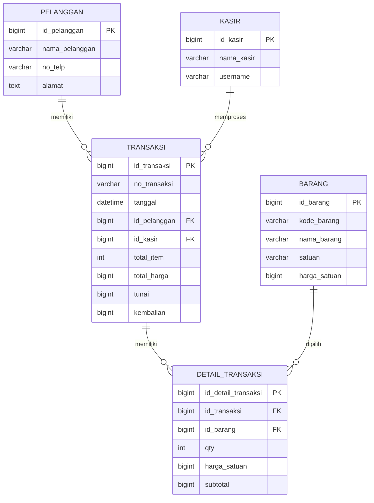

# Analisis & Perancangan Database O! Save (Laravel Project)

## A. Analisis Data dari Struk
1. **Entitas yang terlibat**:
   - `Toko` (informasi toko, tidak disimpan secara terpisah di memenuhi struk)
   - `Pelanggan` (Anonim bila tidak tersedia nama pelanggan)
   - `Kasir` (petugas kasir)
   - `Barang` (produk yang dibeli)
   - `Transaksi` (header transaksi)
   - `Detail_Transaksi` (line item barang per transaksi)

2. **Atribut masing-masing entitas**:
   - `pelanggan`: `id_pelanggan`, `nama_pelanggan`, `no_telp`, `alamat`
   - `kasir`: `id_kasir`, `nama_kasir`, `username`
   - `barang`: `id_barang`, `kode_barang`, `nama_barang`, `satuan`, `harga_satuan`
   - `transaksi`: `id_transaksi`, `no_transaksi`, `tanggal`, `id_pelanggan`, `id_kasir`, `total_item`, `total_harga`, `tunai`, `kembalian`
   - `detail_transaksi`: `id_detail_transaksi`, `id_transaksi`, `id_barang`, `qty`, `harga_satuan`, `subtotal`

3. **Candidate key dan primary key**:
   - Primary key setiap tabel menggunakan `id_*` tunggal.
   - Candidate key:
     - `barang.kode_barang`
     - `transaksi.no_transaksi`
   - Foreign key:
     - `transaksi.id_pelanggan` → `pelanggan.id_pelanggan`
     - `transaksi.id_kasir` → `kasir.id_kasir`
     - `detail_transaksi.id_transaksi` → `transaksi.id_transaksi`
     - `detail_transaksi.id_barang` → `barang.id_barang`

## B. Proses Normalisasi
### 1. UNF (Unnormalized Form)
Tabel awal berisi semua informasi transaksi di satu struktur:

| no_transaksi | tanggal | nama_barang | qty | harga_satuan | subtotal | total_harga | tunai | kembalian |
|--------------|---------|-------------|-----|--------------|----------|-------------|-------|-----------|
| 020.1...     | 01/05/2026 14:27 | Ayam Rolade Chicken 225gr | 1 | 9900 | 9900 | 103500 | 103500 | 0 |
| ...          | ...     | ...         | ... | ...          | ...      | 103500      | 103500 | 0 |

### 2. 1NF
Pisahkan data menjadi tabel yang memiliki nilai atom dan baris terpisah untuk setiap item.

- `pelanggan`
- `kasir`
- `barang`
- `transaksi`
- `detail_transaksi`

### 3. 2NF
Hilangkan dependensi parsial pada primary key gabungan.

- `barang` berisi data produk independen.
- `transaksi` hanya berisi header transaksi.
- `detail_transaksi` menyimpan item per transaksi.

### 4. 3NF
Hilangkan dependensi transitif.

- Data `nama_barang`, `harga_satuan` tidak disimpan ulang di `transaksi`.
- `transaksi` hanya mengacu ke `pelanggan` dan `kasir`.
- `detail_transaksi` mengacu langsung ke `barang`.

## C. Perancangan ERD
Entitas, primary key, foreign key, dan kardinalitas:

## D. Implementasi Fisik Database / DBMS
- DDL tersedia di `database/sql/osave_schema.sql`
- Migration tersedia di `database/migrations/`

### Struktur tabel utama
- `pelanggan`
- `kasir`
- `barang`
- `transaksi`
- `detail_transaksi`

### Constraints yang diterapkan
- Primary key pada setiap tabel
- Foreign key untuk hubungan antar tabel
- Unique constraint pada `barang.kode_barang` dan `transaksi.no_transaksi`

## E. Input Data Menggunakan DML
Data struk disimpan melalui:
- `database/seeders/PelangganSeeder.php`
- `database/seeders/KasirSeeder.php`
- `database/seeders/BarangSeeder.php`
- `database/seeders/TransaksiSeeder.php`
- `database/seeders/DetailTransaksiSeeder.php`

Untuk import manual di phpMyAdmin, gunakan file `database/sql/osave_schema.sql`.
